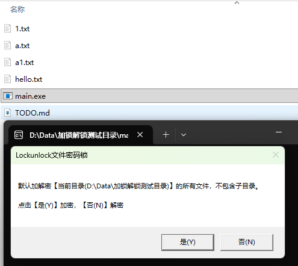
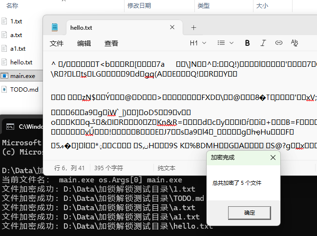

## 简介

本工具使用 `混肴+AES256` 混合加密算法对文件进行加解密。

双击lockunlock.exe，弹出操作框：点击【是(Y)】加密，【否(N)】解密。

适用的加解密对象：包括但不限于图片，文本，word, excel，exe, 音频视频等......


## 截图

- GUI界面



- 加密效果




## 使用说明

为保证文件安全，请保存好32位密钥字符串(即：`--key=xxx`后面的值)。默认密钥：`xxxxxxxxxxxxxxxxxxxxxxxxxxxxxxxx`

1. 双击可执行文件，弹出提示框，加密/解密【当前目录】所有文件，不包括子目录。

2. 通过命令行使用。

### 命令行参数

| 参数 | 缩写 | 类型 | 默认值 | 描述 |
|------|------|------|--------|------|
| `--version` | 无 | bool | false | 显示版本信息 |
| `--opt` | 无 | string | "" | 操作类型：`lock`（加密）或 `unlock`（解密） |
| `--key` | 无 | string | "xxxxxxxxxxxxxxxxxxxxxxxxxxxxxxxx" | 加密/解密使用的密钥（32字符） |
| `--dir` | 无 | string | "" | 指定要操作的目录路径 |
| `--dev` | 无 | bool | false | 开发调试模式 |

使用示例：

```bash
# 测试加锁（加密）功能
lockunlock.exe -dir="D:\Users\yourname\Desktop\加锁解锁测试目录" -opt=lock
# 测试解锁（解密）功能
lockunlock.exe -dir="D:\Users\yourname\Desktop\加锁解锁测试目录" -opt=unlock

# 测试加锁（加密）功能，指定密钥
lockunlock.exe -dir="D:\Users\yourname\Desktop\加锁解锁测试目录" -opt=lock --key "your-32-char-encryption-key"
# 测试解锁（解密）功能，指定密钥
lockunlock.exe -dir="D:\Users\yourname\Desktop\加锁解锁测试目录" -opt=unlock --key "your-32-char-encryption-key"
```


## 原理

计算机一切文件的底层都是二进制。
基于此，可以运用数学密码学算法，对任意私有文件，进行加密解密。
包括但不限于图片，文本，word, excel，exe, 音频视频等......

加密：先将文件字节数组首尾颠倒，然后每隔37个字节插入随机17个节。最后进行AES-256加密。
解密：对上面步骤进行逆序。先进行AES-256解密，然后每隔37个字节删除17个节，最后将文件字节数组首尾颠倒。


## Windows下编译

```bash
# 生成图标和版本信息
go install github.com/josephspurrier/goversioninfo/cmd/goversioninfo@latest
goversioninfo versioninfo.json

# 编译
go build -v -o lock.exe -trimpath -ldflags "-s -w -linkmode internal -buildid= -X 'main.AppVersion=v0.0.1' -X 'main.GoVersion=`go version`'" .
```


## 免责声明

### 软件性质声明

本软件为基于MIT开源协议发布的免费开源项目，仅供学习和研究目的使用。作者不对软件的适用性、安全性或可靠性作任何明示或默示的担保。

### 责任限制

用户在使用本软件进行文件加解密时，应自行承担所有风险。因使用本软件导致的任何直接或间接损失，包括但不限于数据丢失、文件损坏、商业损失等，作者及贡献者均不承担任何法律责任。

### 用户责任

用户需知悉加密文件存在因密码遗忘、算法故障等原因导致永久无法解密的可能。建议用户在使用前对重要文件进行备份，并自行测试软件功能。

### 法律约束

本免责声明受当地法律管辖，如任何条款被认定为无效，不影响其余条款的效力。

参考依据：

- MIT许可证条款：https://opensource.org/licenses/MIT

- 开源软件责任限制惯例
